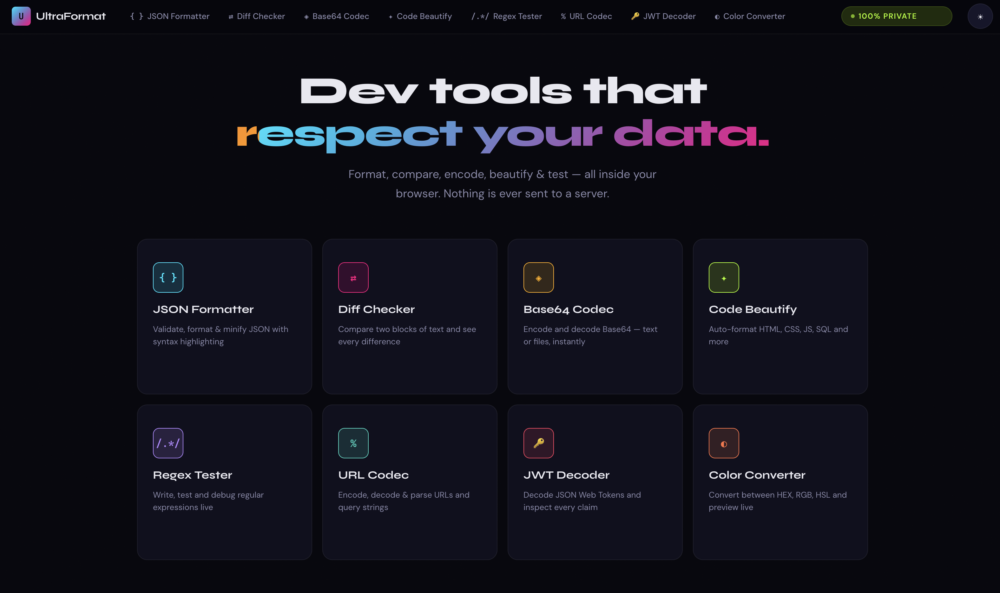

# UltraFormat

**A self-hosted, privacy-first developer toolkit that runs entirely in your browser.**

No telemetry. No server calls. No tracking. No cookies. Every byte stays on your machine.



This project can be run locally directly, via a Docker container, deployed on a company intranet, or hosted on a Raspberry Pi.

It also available at [https://ultraformat.dev](https://ultraformat.dev) — a free public instance with no ads, no tracking, and no data collection. If you find it useful, consider hosting your own instance or contributing to the project!

---

## Why?

Every time you paste a JWT into an online decoder, format JSON on a random website, or decode Base64 with a Google result — you're sending potentially sensitive data to a server you don't control. API keys, auth tokens, PII, proprietary code — it all gets shipped off to someone else's infrastructure.

UltraFormat is the alternative. It's a single-page React app that you build once and serve from anywhere — your laptop, your company intranet, a Raspberry Pi on your desk. All processing happens client-side in the browser. Nothing ever leaves the page.

## Tools

| Tool | Description |
|------|-------------|
| **JSON Formatter** | Validate, format & minify JSON with instant error feedback |
| **Diff Checker** | Side-by-side or inline text comparison with character-level highlighting |
| **Base64 Codec** | Encode & decode Base64 — supports text, files, and full Unicode |
| **Code Beautify** | Auto-format HTML, CSS, JavaScript, TypeScript, JSON, Markdown, and SQL via Prettier |
| **Regex Tester** | Write, test, and debug regular expressions with live match highlighting |
| **URL Codec** | Encode, decode & parse URLs with automatic query string breakdown |
| **JWT Decoder** | Decode JSON Web Tokens and inspect headers, payloads, and claims |
| **Color Converter** | Convert between HEX, RGB, and HSL with a live preview swatch and sliders |

## Features

- **100% client-side** — no data ever leaves your browser
- **Dark & light themes** — with OS preference detection and `localStorage` persistence
- **Accessible** — WCAG-compliant contrast, `prefers-reduced-motion` support, keyboard navigation, focus indicators, screen reader–friendly markup
- **Fast** — sub-second load, no external API calls, no spinners
- **Responsive** — works on desktop and tablet viewports
- **121 unit tests** — across all tools and components
- **Zero cookies, zero analytics, zero ads**

## Tech Stack

- [React 19](https://react.dev/) + [TypeScript 5.9](https://www.typescriptlang.org/)
- [Vite 7](https://vite.dev/) for builds and dev server
- [React Router 7](https://reactrouter.com/) for client-side routing
- [Prettier 3](https://prettier.io/) for the Code Beautify tool
- [Vitest](https://vitest.dev/) + [Testing Library](https://testing-library.com/) for tests

No UI framework. No component library. Hand-written CSS with a custom design system.

## Quick Start

### Prerequisites

- [Node.js](https://nodejs.org/) 24+ (or use Docker — see below)
- npm 10+

### Install & Run

```bash
git clone https://github.com/bocan/ultraformat.git
cd ultraformat
npm install
npm run dev
```

Open [http://localhost:5173](http://localhost:5173) in your browser.

### Using Make

```bash
make install   # npm install
make dev       # start dev server
make test      # run unit tests
make build     # type-check + production build
make preview   # build then preview at localhost:4173
make clean     # remove dist/ and Vite caches
```

## Production Build

```bash
npm run build
```

This outputs a static site to `dist/`. The entire app is just HTML, CSS, and JS — no server runtime required. Serve it from anywhere that can host static files.

## Deploying Behind Nginx

Build the app, then point Nginx at the `dist/` directory. The only trick is that React Router uses client-side routing, so all paths need to fall through to `index.html`.

### Example Nginx Configuration

```nginx
server {
    listen       80;
    server_name  tools.example.com;
    root         /var/www/ultraformat/dist;
    index        index.html;

    # Serve static assets directly with long cache
    location /assets/ {
        expires 1y;
        add_header Cache-Control "public, immutable";
    }

    # Client-side routing — send all requests to index.html
    location / {
        try_files $uri $uri/ /index.html;
    }

    # Security headers
    add_header X-Frame-Options "SAMEORIGIN" always;
    add_header X-Content-Type-Options "nosniff" always;
    add_header Referrer-Policy "no-referrer" always;
    add_header Content-Security-Policy "default-src 'self'; style-src 'self' 'unsafe-inline' https://fonts.googleapis.com; font-src 'self' https://fonts.gstatic.com; script-src 'self'; connect-src 'none'; img-src 'self' data:; object-src 'none'; frame-src 'none'" always;
}
```

Then deploy:

```bash
npm run build
sudo cp -r dist/ /var/www/ultraformat/dist
sudo nginx -t && sudo systemctl reload nginx
```

### With Docker

A `Dockerfile` and `docker-compose.yml` are included. The image uses a multi-stage build (Node 24 → Nginx Alpine) so the final container has no Node runtime — just static files behind Nginx with security headers.

```bash
# Using Docker directly
docker build -t ultraformat .
docker run -d -p 8080:80 ultraformat

# Using Docker Compose
docker compose up -d
```

Then open [http://localhost:8080](http://localhost:8080).

## Running Tests

```bash
npm test            # single run
npm run test:watch  # watch mode
```

## Project Structure

```
src/
├── components/      # Layout shell, topbar, navigation
├── lib/             # Pure algorithms (diff engine, Prettier wrapper)
├── pages/           # One file per tool + matching CSS
├── __tests__/       # Unit tests for every tool and component
├── tools.ts         # Tool registry (names, colors, routes)
├── useTheme.tsx     # Theme provider (dark/light + OS detection)
├── App.tsx          # Route definitions
├── main.tsx         # Entry point
└── index.css        # Design system (colors, typography, utilities)
```

## License

MIT

---

*Built because your data is nobody else's business.*
